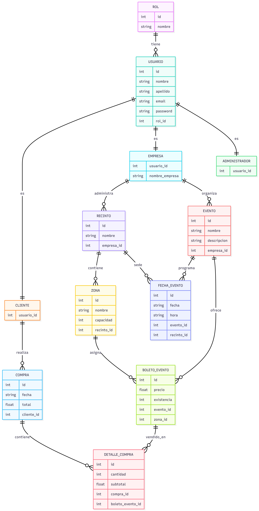

# TESSERA

## Problemática
En México, la plataforma de venta de boletos más grande es Ticketmaster; sin embargo, esto deja a los pequeños promotores con pocas opciones accesibles para vender sus boletos de forma regulada y profesional. Tessera busca dar a estos promotores la oportunidad de compartir y regularizar la venta de sus boletos mediante una plataforma accesible e intuitiva, que además permita a los usuarios visualizar de forma clara y justa el recinto, para que puedan reconocer exactamente qué zona están adquiriendo. Todo esto con bajos costos para el usuario final.

## Integrantes de equipo 13:
- Salinas Cenobio Leonel Isaac
- Pliego Mendez Alondra
- Gomez Garcia Paris Lizette

## Tecnologías utilizadas

**Backend**
- Java 25
- Spring Boot 4.1.0 (Web, Data JPA, Security, Validation, Mail)
- Spring Security + JWT (io.jsonwebtoken / jjwt 0.12.6)
- MySQL (mysql-connector-j)
- Flyway (versionado de esquema de base de datos)
- Maven
- Lombok
- Hibernate

**Integraciones externas**
- Seatmap.pro — mapas interactivos de recintos/zonas
- Twilio — envío de SMS y WhatsApp
- Postfix (SMTP) — envío de correos de confirmación

**Herramientas de pruebas y control de versiones**
- Bruno — colección de pruebas de la API
- Git & GitHub

## Instalación

### 1. Clonar el repositorio

```bash
git clone https://github.com/AlondraPliego/tessera_eq13.git
```

### 2. Entrar al proyecto

```bash
cd tessera_eq13/backend
```

### 3. Configurar la base de datos

Crear una base de datos MySQL:

```sql
CREATE DATABASE tessera_db;
```

Copiar el archivo de ejemplo y renombrarlo:

```bash
cp src/main/resources/aplication.properties.example src/main/resources/application.properties
```

Editar `application.properties` con tus credenciales reales de MySQL (usuario, contraseña) y, si vas a probar las integraciones externas, con tus propias claves:

| Propiedad | Uso |
|---|---|
| `spring.datasource.username` / `password` | Credenciales de tu MySQL local |
| `jwt.secret` | Clave para firmar los tokens JWT (usa una larga y única) |
| `spring.mail.*` | Servidor SMTP para el envío de correos de confirmación |
| `twilio.*` | Credenciales de Twilio para SMS/WhatsApp |
| `seatmap.*` | Credenciales de la organización en Seatmap.pro |

> `application.properties` no se sube a GitHub (está en `.gitignore`), por eso cada integrante configura el suyo localmente a partir del `.example`.

### 4. Ejecutar el proyecto

```bash
mvn spring-boot:run
```

Flyway ejecutará automáticamente todas las migraciones (`V1` a `V7`) al iniciar la aplicación, dejando el esquema y los datos de prueba listos.

## Migraciones de Base de Datos

| Migración | Descripción |
|-----------|-------------|
| **V1__create_roles_usuarios.sql** | Crea `rol`, `usuario` y las tablas de datos extra por rol: `clientes`, `empresas`, `administradores`. |
| **V2__create_recintos_zonas.sql** | Crea `recinto` y `zona`. |
| **V3__create_eventos_boletos.sql** | Crea `evento`, `fechas_eventos` y `boleto_evento` (precio por zona/evento). |
| **V4__create_compras_detalle.sql** | Crea `compra` y `detalle_compra`, la tabla asociativa N:M entre compras y boletos. |
| **V5__seed_data.sql** | Inserta datos iniciales (roles, 15 usuarios, 12 recintos, 30 zonas, 15 eventos, boletos y compras de prueba). |
| **V6__seatmap_integracion.sql** | Agrega columnas de integración con Seatmap.pro (`seatmap_schema_id`, `seatmap_object_id`, `seatmap_event_id`). |
| **V7__create_reservas.sql** | Crea `reserva`, para el bloqueo temporal de boletos mientras un cliente completa su compra. |

## Modelo Entidad–Relación

El sistema utiliza una base de datos relacional administrada mediante Flyway, donde todas las tablas son creadas y versionadas mediante migraciones SQL.

Las principales relaciones son:

- **Rol → Usuario**: un rol puede pertenecer a muchos usuarios (1:N).
- **Usuario → Cliente / Empresa / Administrador**: relación uno a uno (1:1), según el rol del usuario.
- **Empresa (Usuario) → Recinto**: una empresa puede administrar varios recintos (1:N).
- **Recinto → Zona**: un recinto contiene múltiples zonas (1:N).
- **Empresa (Usuario) → Evento**: una empresa puede organizar varios eventos (1:N).
- **Evento → FechaEvento**: un evento puede tener varias fechas/funciones programadas (1:N).
- **Recinto → FechaEvento**: cada función se realiza en un recinto específico (1:N).
- **Evento → BoletoEvento**: un evento ofrece distintos tipos de boleto (1:N).
- **Zona → BoletoEvento**: una zona puede estar asociada a varios boletos, de distintos eventos (1:N).
- **Cliente (Usuario) → Reserva**: un cliente puede tener varias reservas temporales de boletos (1:N).
- **BoletoEvento → Reserva**: un boleto puede tener varias reservas activas mientras haya disponibilidad (1:N).
- **Cliente (Usuario) → Compra**: un cliente puede realizar múltiples compras (1:N).
- **Compra ↔ BoletoEvento**: relación N:M resuelta mediante **DetalleCompra**, con atributos propios (`cantidad`, `subtotal`).



## Credenciales de prueba

La migración `V5__seed_data.sql` deja precargados 15 usuarios, todos con la misma contraseña:

**Contraseña para todos:** `Tessera123!`

| Rol | Email | Notas |
|---|---|---|
| **Administrador (evaluación)** | `admin@tessera.com` | Nivel de acceso `SUPER_ADMIN`, ve todas las compras del sistema |
| Empresa | `empresa1@tessera.com` | Ticket Entertainment — dueña de varios recintos/eventos |
| Empresa | `empresa2@tessera.com` | Pro Events |
| Empresa | `empresa3@tessera.com` | Live Nation Local |
| Empresa | `empresa4@tessera.com` | Max Show |
| Cliente | `cliente1@tessera.com` … `cliente10@tessera.com` | Clientes con compras de prueba ya asociadas |

## URL base de la API

**Entorno local:**
```
http://localhost:8080
```

**Entorno de producción (VPS):**
```
https://tessera.rocks
```

## GitHub Projects
https://github.com/users/AlondraPliego/projects/2

## Link de Figma
Link del prototipo de Figma "TESSERA":
https://www.figma.com/proto/raYtsCgJRL17HA7ae6XHXe/BOLETERIA-OAXACA?node-id=3-14&p=f&t=6kZF8IE23iCrELK5-0&scaling=min-zoom&content-scaling=fixed&page-id=0%3A1&starting-point-node-id=3%3A5